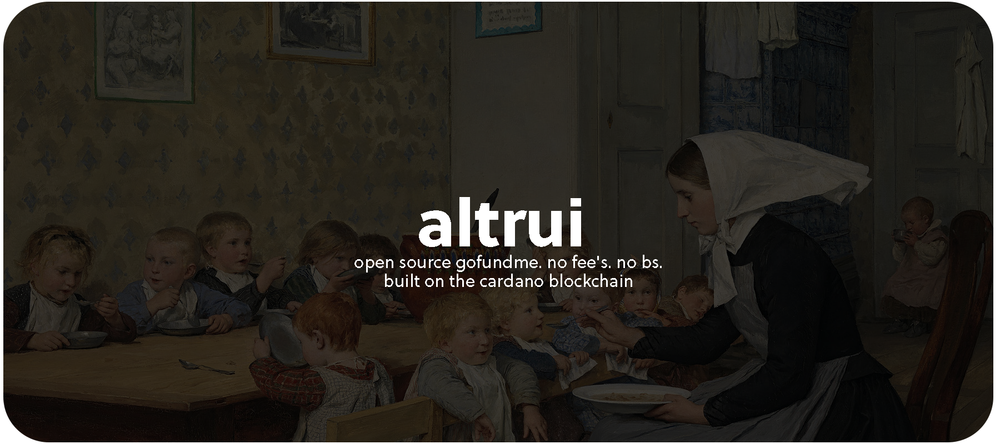

# altrui
Altrui is an open-source decentralized "gofundme" built to work on the Cardano Blockchain. no fees, and no more funds being held by a company. 

Community - [discord](https://discord.gg/aXXA9UsW2M) • [twitter](https://twitter.com/AltruiTweets) 

> “Die Kinderkrippe” (La guardería), 1890, de Albert Anker.

---
# why?
A friend's family member died because an influencer decided to comment on a public podcast about the campaign. He said that the person running the campaign didn't have covid-19. GoFundMe retained the funds, then the hospital couldn't keep him. He died two days after.

Thank You Influencers, Thank You Venezuela, and especially Thank You GoShitMe. 

---

development branch - [dev](https://github.com/FreddyJD/altrui/tree/dev)